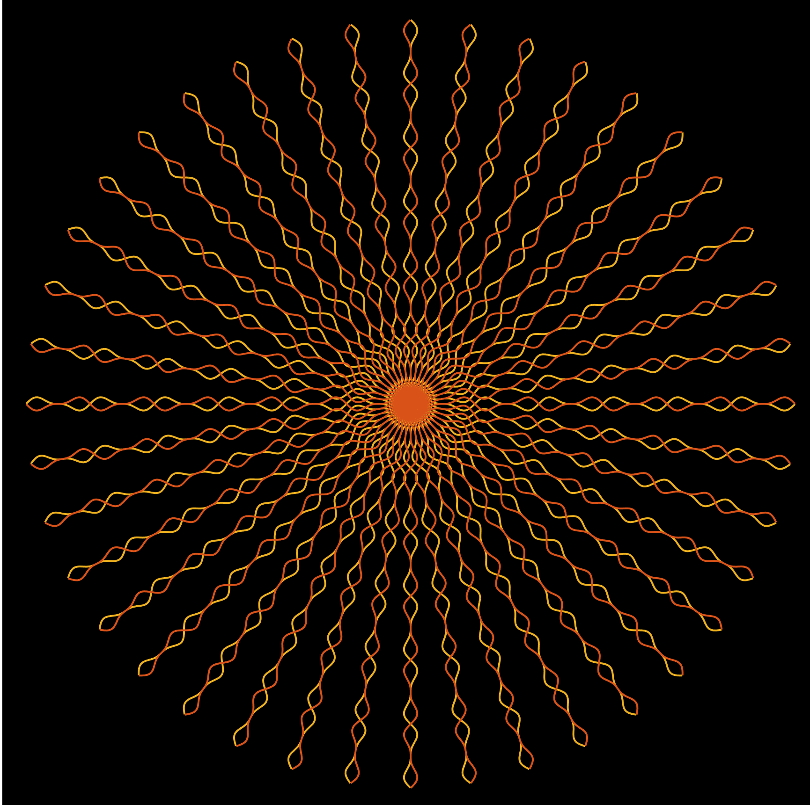

# Circle with Wavy Lines Visualization

This MATLAB script generates a captivating visualization depicting a circle overlaid with wavy lines. The code utilizes MATLAB's plotting capabilities to create an aesthetically pleasing graphical representation.

## Output Description

The output of the code is a visualization of a circle overlaid with wavy lines. The wavy lines are created using mathematical functions, resulting in an intriguing visual pattern.

## How to Use

### Open the MATLAB Script

Open the `circle_with_wavy_lines.m` MATLAB script.

### Run the Script

Execute the script within the MATLAB environment.

### Observe the Visualization

Upon execution, a figure window will open displaying the circle with wavy lines. The visualization will remain static for 5 seconds before additional designs are added.

## Code Description

### Opening the Figure Window:

The `figure()` function is used to open a window for plotting.

### Static Display:

The `pause(5)` function is utilized to keep the page static for 5 seconds.

### Creating the Axis:

An axis is created with x-axis ranging from -20 to 20 and y-axis ranging from -20 to 20, drawn in black color.

### Plotting the First Design:

- The function `sin(t).*cos(t).^3` is plotted in the range `[0, 6*pi]` with a step size of 0.01.
- The plot is styled with a specific color (`[0.9290 0.6940 0.1250]`) and double thickness using `linewidth`.
- This plot is repeated 50 times in a loop to form a circle.

### Plotting the Second Design:

- A similar process is followed to plot a second design with a different color and direction.
- This plot is also repeated 50 times to form a circle.

### Saving and Displaying the Drawings:

- The `hold on` command is used to preserve the drawings.
- The `axis equal` command ensures equal length and width of the drawing.
- The visualization is displayed with both designs overlaid.
